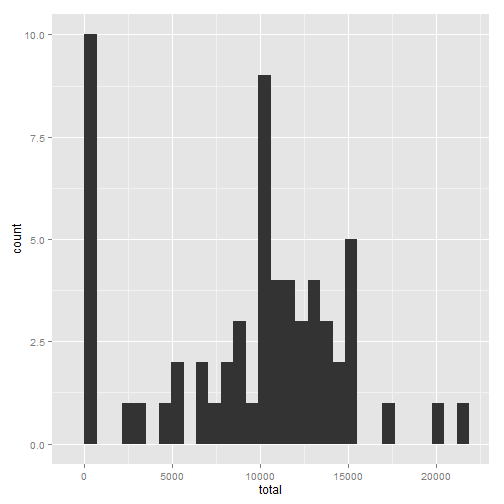
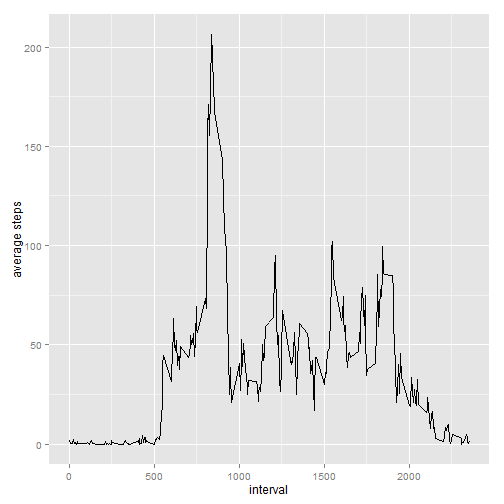
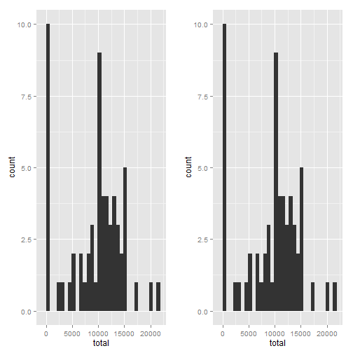
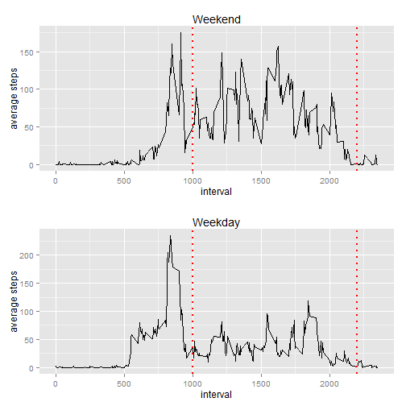

## Loading and preprocessing the data

```r
library(dplyr)
library(ggplot2)
library(caret)
library(RANN)
library(gridExtra)
```


```r
data <- read.csv("activity.csv")
data$date <- as.Date(data$date, "%Y-%m-%d") ##parse dates
data$weekday <- weekdays(data$date) ## gets the weekday
data$weekend <- data$weekday %in% c("Saturday", "Sunday") ## flag for Weekwend/weekeday. TRUE =  = weeend
```
## What is mean total number of steps taken per day?


```r
groupedByDay <- data %>% group_by(date) %>% summarize (total = sum(steps, na.rm =TRUE))
hist1<-ggplot(groupedByDay, aes(total)) + geom_histogram()
hist1
```

```
## stat_bin: binwidth defaulted to range/30. Use 'binwidth = x' to adjust this.
```

 

```r
meanByTotalNumberOfStepsPerDay <- mean(groupedByDay$total, na.rm =TRUE)
medianByTotalNumberOfStepsPerDay <- median(groupedByDay$total, na.rm =TRUE) 
meanByTotalNumberOfStepsPerDay
```

```
## [1] 9354.23
```

```r
medianByTotalNumberOfStepsPerDay
```

```
## [1] 10395
```
## What is the average daily activity pattern?

```r
byInterlval <-data %>% group_by(interval) %>% summarize(avg = mean(steps, na.rm=TRUE)) %>% arrange(desc(avg))
ggplot(byInterlval, aes(interval, avg)) + geom_line() +
   xlab("interval") + ylab("average steps")
```

 

```r
FiveMinIntervalWithTheMaxNumberOfSteps <- byInterlval[1,]
FiveMinIntervalWithTheMaxNumberOfSteps
```

```
## Source: local data frame [1 x 2]
## 
##   interval      avg
## 1      835 206.1698
```
## Imputing missing values

```r
## Median imputation through  the caret package
pp<- preProcess(data, method="medianImpute") 
medianImpute <-predict(pp, data)$steps

## new dataset with missing data filled in
dataMedianImpute <- data
dataMedianImpute$steps <- medianImpute

##Make a histogram of the total number of steps taken each day and Calculate and report the mean and median total number of steps taken per day.
groupedByDayImpute <- dataMedianImpute %>% group_by(date) %>% summarize (total = sum(steps, na.rm =TRUE))
hist2<-ggplot(groupedByDayImpute, aes(total)) + geom_histogram()
grid.arrange(hist1, hist2, ncol=2)
```

```
## stat_bin: binwidth defaulted to range/30. Use 'binwidth = x' to adjust this.
## stat_bin: binwidth defaulted to range/30. Use 'binwidth = x' to adjust this.
```

 

```r
meanByTotalNumberOfStepsPerDayImpute <- mean(groupedByDayImpute$total, na.rm =TRUE)
medianByTotalNumberOfStepsPerDayImpute <- median(groupedByDayImpute$total, na.rm =TRUE) 
meanByTotalNumberOfStepsPerDayImpute
```

```
## [1] 9354.23
```

```r
medianByTotalNumberOfStepsPerDayImpute
```

```
## [1] 10395
```

Impact of imputing the data is almost non existent for this dataset. Neither the summary statistics nor the histogram show any relevant impact.


## Are there differences in activity patterns between weekdays and weekends?


```r
## weekeday/weekend column was calculated in the Loading and preprocessing the data section
byInterlvalWeekend <-data %>% group_by(interval,weekend) %>% summarize(avg = mean(steps, na.rm=TRUE)) %>% arrange(desc(avg))
line1<- ggplot(byInterlvalWeekend %>% filter(weekend), aes(interval, avg)) + geom_line() + ggtitle("Weekend") +
   xlab("interval") + ylab("average steps") + geom_vline(xintercept=c(1000,2200), linetype="dotted", colour = "red", size= 1)
line2<- ggplot(byInterlvalWeekend %>% filter(!weekend), aes(interval, avg)) + geom_line() + ggtitle("Weekday") +
   xlab("interval") + ylab("average steps") + geom_vline(xintercept=c(1000,2200), linetype="dotted", colour = "red", size= 1)
grid.arrange(line1, line2, nrow=2)
```

 

The steps taken on weekends between on intervals from 1000-2200 are higher than those on weekdays. See the section on both histograms between the vertical red lines.
